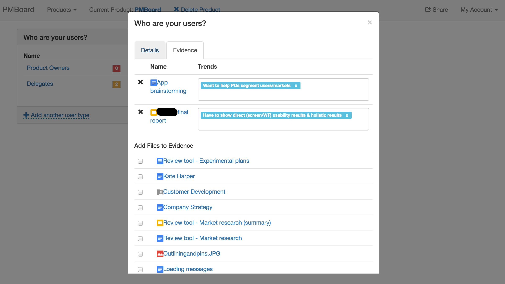

PMBoard is a dashboard for product managers and startup founders to link user research, product features/plans,
and evaluation results.

It is a Node.js application with a Javascript frontend that utilizes React.

To run, you need to have a PostgreSQL instance on the default port with a database named **pmboard**
either containing all the relevant tables, or load the data from `pmboard-dump.sql`.

Then, clone the repo, do <code>yarn install</code>, and finally run <code>yarn start</code>
and go to <code>http://localhost:8000</code>, authenticating on the OAuth page with your Google account.
