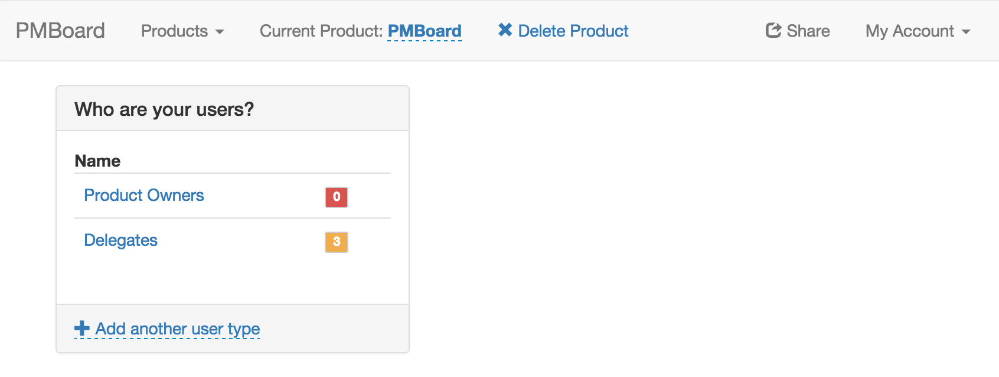
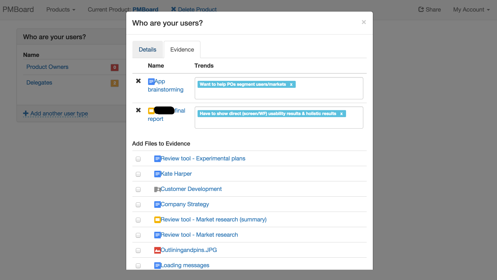

# 🗺️ pmboard

**Spatial sensemaking dashboard linking user research, product features, and evaluation feedback.**

`pmboard` is Datagotchi Labs' visual product discovery surface area. Built as an API-first spatial interface, it connects qualitative user research (e.g., empathy mapping, interviews) directly to feature epics and metric evaluations—eliminating isolated specs and fragmented product decisions.




---

## 🎯 The Friction & The Solution

Product teams and founders routinely struggle with **context loss** and **siloed research**:
* **Disconnected Insights:** Qualitative user research lives in static docs, isolated from actual roadmap tickets and feature specs.
* **Metric Myopia:** Feature evaluations happen in spreadsheets, detached from the original user problems they were built to solve.
* **Arbitrary Box-Checking:** Product management tools encourage bloated backlogs over clear spatial sensemaking.

**`pmboard` solves this by:**
1. Providing a unified spatial surface area to map research, epics, and evaluations together.
2. Visualizing user empathy maps (`EmpathyMapPane`) alongside feature benefits and delivery goals.
3. Keeping data sovereign and locally controlled via explicit schemas.

---

## 🏗️ System Architecture

```mermaid
graph TD
    A[Qualitative Research / Empathy Maps] --> B{pmboard Spatial Engine}
    C[Product Epics / Feature Specs] --> B
    D[Evaluation Results / Metrics] --> B
    
    B -->|Persist State| E[(PostgreSQL)]
    B -->|Render Spatial Dashboard| F[React / Express Web UI]
    
    style B fill:#2b2b2b,stroke:#00ffcc,color:#fff
    style E fill:#1f1f1f,stroke:#ff0055,color:#fff
